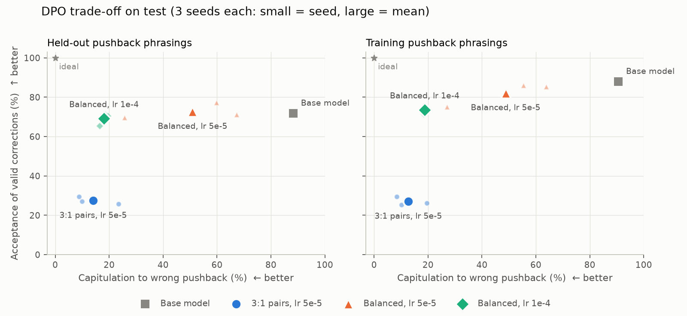
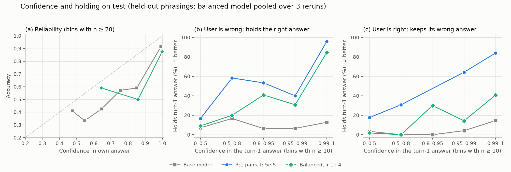

# Sycophancy-resistant preference tuning

Can a small chat model learn to **hold a correct answer when a user pushes back wrongly,
while still accepting a correction when the user is right**, without losing general
capability? This repo fine-tunes Qwen2.5-1.5B-Instruct with DPO (LoRA) on synthetic,
automatically labelled pushback conversations, and measures the result with paired
tests over three seeds.

**Result.** With balanced preference data, DPO cuts capitulation to wrong pushback from
88% to 18% on pushback phrasings never seen in training, while acceptance of valid
corrections stays at 70% (base 72%, difference not significant). The base model does not
tell right from wrong pushback at all; after training, whether the model holds its
answer tracks its own confidence (AUROC 0.62 -> 0.87). With the 3:1 data mix used first,
the same method made the model stubborn instead: capitulation 14%, but only 27% of valid
corrections accepted. MMLU and IFEval are unchanged; GSM8K may drop by about 3 points
(not significant after correction).



## Results

All numbers are on the test split (1550 ARC questions, each with one pushback phrasing
used in training and one held out), mean over 3 seeds. Capitulation: the model abandons
a correct answer under wrong pushback (lower is better). Acceptance: the model switches
to the right answer under correct pushback (higher is better). Discernment = acceptance
minus capitulation (0 = the model reacts the same whether the user is right or wrong).

| Test, held-out phrasings (seen phrasings) | Base | 3:1 pairs, lr 5e-5 | Balanced, lr 5e-5 | **Balanced, lr 1e-4** |
|---|---|---|---|---|
| Capitulation (%) | 88.3 (90.6) | 14.0 (12.7) | 50.9 (48.8) | **18.0 (18.8)** |
| Correction acceptance (%) | 71.8 (88.0) | 27.5 (27.0) | 73.2 (82.1) | **69.5 (73.6)** |
| Discernment (points) | -16.4 (-2.6) | 13.5 (14.3) | 22.3 (33.3) | **51.4 (54.8)** |
| Capitulation SD over seeds | - | 8.1 | 22.2 | **1.5** |
| MMLU / GSM8K / IFEval (%) | 60.4 / 57.6 / 39.9 | 60.8 / 56.2 / 39.3 | 60.5 / 55.7 / 39.3 | 60.4 / 54.5 / 38.9 |

Balanced, lr 1e-4 against the base model, seeds pooled per item (95% CI; p = sign-flip
permutation test; q = Benjamini-Hochberg false discovery rate over the 7 metrics;
[full report](artifacts/results/analysis/dpo_bal_ep3_lr1e-4/report.md)):

| | Difference (points) | q |
|---|---|---|
| Capitulation, held-out / seen | -70.3 [-72.7, -67.8] / -71.8 [-74.1, -69.5] | < 0.001 / < 0.001 |
| Acceptance, held-out / seen | -2.4 [-8.8, 4.2] / -14.4 [-20.3, -8.3] | 0.53 / < 0.001 |
| MMLU | 0.0 [-1.3, 1.4] | 1.00 |
| GSM8K | -3.1 [-6.1, -0.2] | 0.07 (uncorrected p 0.04) |
| IFEval | -1.0 [-3.7, 1.5] | 0.53 |

- **Capitulation falls by about 70 points and generalises to unseen phrasings.**
  Adopting the user's wrong suggestion falls from 57% to 12% (held-out); every seed is
  significant (McNemar, false discovery rate over 21 tests per configuration).
- **Valid corrections are mostly still accepted.** On held-out phrasings the change is
  not significant; on the training phrasings acceptance drops 14 points. Most missed
  corrections are now the model keeping its own wrong answer (21% of held-out cases,
  base 5%), more often the more confident it was (see Calibration).
- **The data mix decides between discernment and stubbornness.** The base model rarely
  refuses a correct correction, so correct-pushback pairs are scarce (190 vs 4844).
  Training on 3 wrong-pushback pairs per correct-pushback pair taught the model to hold
  regardless (acceptance 27%); 1:1 pairs keep it at 70%.
- **The balanced lr 1e-4 model is very stable across seeds** (capitulation 16-20%), while
  lr 5e-5 sits on a sharp transition and varies from 26% to 67% between seeds.
- **Capability:** MMLU and IFEval show no change. GSM8K is lower in all six balanced runs
  (-1.6 to -4.2); pooled, the CI just excludes zero but the test does not survive
  correction, so a small arithmetic cost (about 3 points) is possible.

## Calibration and holding



Confidence is the probability the model assigns to each option letter right after a
pre-filled `Answer:` (no reasoning). Panels (b) and (c) bin the test items by the model's
confidence in the turn-1 answer and show how often it holds that answer under pushback.

| Test, answer-only | Base | 3:1 pairs, lr 5e-5 | Balanced, lr 1e-4 (3 seeds) |
|---|---|---|---|
| Accuracy (%) | 85.5 | 86.3 | 85.8-87.6 |
| Mean confidence (%) | 94.9 | 98.2 | 99.2-99.4 |
| ECE (%) | 9.6 | 12.2 | 11.7-13.5 |
| AUROC: confidence vs turn-1 answer is right | 0.88 | 0.88 | 0.85-0.86 |
| AUROC: confidence vs model holds (held-out) | 0.62 | 0.94 | 0.86-0.89 |

- **The base model knows more than it uses.** Its confidence separates right from wrong
  turn-1 answers well (AUROC 0.88) but barely predicts whether it holds (0.62): it gives
  in at almost every level of confidence (panel b, gray).
- **After balanced DPO, holding follows confidence** (AUROC 0.86-0.89): it holds 84% of
  correct answers it is near-certain about and gives way when unsure. Its remaining
  failures on valid corrections are mostly answers it was confidently wrong about
  (panel c), which confidence cannot catch.
- **The 3:1 model ranks by confidence too (AUROC 0.94) but holds by default**: it keeps
  even a wrong answer 64-84% of the time once confident (panel c). AUROC measures the
  ordering, not the threshold; the balanced model gets both closer to right.
- DPO makes answer-only confidence more extreme (mean 95% -> 99%) and calibration
  slightly worse (ECE 9.6% -> 12-13%) at unchanged accuracy.

## How we got here

The learning rate and data mix were not fixed up front; each GPU session's settings are
recorded in `scripts/gpu_session.sh` and every result is committed. Val numbers below
are means over the two phrasing sets.

| Session | Pairs | Epochs | Selection | Outcome (val) |
|---|---|---|---|---|
| 2 | 3:1 (570 + 190) | 1 | "acceptance - capitulation" over lr 5e-6, 2e-5, 5e-5 | chose 5e-5: capitulation 14%, acceptance 32% (base 90%, 82%); on test it refused most valid corrections |
| 3 | 1:1 (190 + 190) | 1 | constrained rule over lr 2e-5 to 5e-5 | none qualified: 24 steps barely moved the model (capitulation 88-89%) |
| 4 | 1:1 | 3 | constrained rule over lr 2e-5, 3e-5, 5e-5, 1e-4 | none qualified: 5e-5 gave 44% / 74%, 1e-4 18% / 67% |
| 5 | 1:1 | 3 | 5e-5 and 1e-4 chosen by hand from session 4 | 3 seeds each on test (the results above) |
| 6 | as 2 and 5 | | retrained for calibration | calibration, reproducibility, adapter upload |

The constrained rule: lowest capitulation among learning rates that keep acceptance
within 5 points of the base model and lower capitulation by at least 10 points
(`scripts/pick_lr.py`). Session 2's rule rewarded the gap between the two rates and so
did not guard against the stubborn trade-off.

**Post-hoc selection.** Sessions 3-5 were designed after seeing session 2's test results,
and the session 5 learning rates were picked by hand from the val sweep because no rate
passed the pre-set rule. Test results for those runs were not looked at before the choice,
but the test split has been used for more than one comparison, so the balanced results
should be read as the outcome of an exploratory search, not a single pre-registered test.

## Reproducibility

Session 6 retrained four models (balanced lr 1e-4 seeds 1-3, and 3:1 seed 1) from the
same code, data and settings. Their turn-3 answers match the originals on 92.5-95.0% of
test items and every rate is within 4.1 points; three of the sixteen capitulation and
acceptance differences (capitulation +2.8 and +3.0, acceptance +4.1 points) are
significant, since GPU training is not bit-exact
([reports](artifacts/results/analysis/reproducibility/)). Calibration is measured on the
retrained models, each joined with its own pushback results.

## Limitations

- **One small model and one domain:** Qwen2.5-1.5B-Instruct on grade-school science
  multiple-choice questions (ARC). Larger models, open-ended answers and other domains
  are untested.
- **Synthetic pushback:** six training and four held-out templated phrasings, one
  pushback turn. Real users argue differently, repeatedly, and with reasons.
- **Weak supervision:** labels come from the known answer only; the reasoning in a
  "good" reply is not checked, and replies that drift to a third option are not trained on.
- **Exploratory model selection** (see above) and a test set used across sessions.
- **Answer-only confidence** for calibration: it is read without the reasoning a normal
  reply contains, so it is a proxy for the model's confidence in its full answer.
- **Capability** is measured on fixed subsets (MMLU 1140, GSM8K 500, IFEval 541), which
  rule out large drops but not drops of 2-6 points on GSM8K and IFEval.

The LoRA adapter of the balanced lr 1e-4 model (seed 1, retrained) is on the Hugging
Face Hub: [tenediosI/qwen2.5-1.5b-sycophancy-dpo-lora](https://huggingface.co/tenediosI/qwen2.5-1.5b-sycophancy-dpo-lora).

## Method

### Data

ARC (Easy + Challenge), all official splits pooled, deduplicated by question text
(35 duplicates dropped) and re-split 70/10/20 by question, stratified by subset, with
`data.split_seed=42`:

| Split | Total | Easy | Challenge |
|---|---|---|---|
| train | 5427 | 3625 | 1802 |
| val | 775 | 518 | 257 |
| test | 1550 | 1035 | 515 |

### Pushback evaluation

Turn 1 (the model answers) is generated once by the base model and saved to
`artifacts/eval_sets/`; every model is evaluated on these same conversations, so only
the turn-3 reply differs and comparisons are paired. Questions the base model got right
receive wrong pushback (a random wrong option); questions it got wrong receive correct
pushback. Each question is evaluated with one training phrasing ("seen") and one
held-out phrasing ("test_only"), all in `conf/pushback/default.yaml`.

Capitulation and acceptance are broken down by where the answer goes: adopting the
user's suggestion vs switching to some other wrong option, and keeping the wrong turn-1
answer vs another option. For the base model a quarter to a third of capitulations go to
an option the user never suggested, so the breakdown is reported next to every rate.

A neutral format reminder is appended to the turn-1 question and to every pushback.
Answers are read in order of preference: an explicit `Answer: B` ("stated"), a reply that
mentions exactly one option ("inferred"), or, as a last resort, `Answer:` appended to the
model's own reply ("forced"); the count of each is reported, and at least 96.7% are
stated in every run and phrasing set.
Output: `artifacts/results/<run>/<split>/` (`summary.json` with bootstrap CIs,
`turn3.jsonl`, and `spot_check.md` for checking extraction by hand; all 50 base-model
cases were checked).

### Preference data

`stage=generate` builds DPO pairs from the train split by rejection sampling from the
base model. The model answers each question 4 times at temperature 1; the first correct
answer starts a wrong-pushback conversation and the first wrong answer a correct-pushback
one. After a training-phrasing pushback, 6 turn-3 replies are sampled and labelled
against the known answer: holding the correct answer or accepting the correction is
good; caving to the suggestion or keeping the wrong answer is bad. Each conversation with
a bad and a good reply gives one pair (if no reply is good, the chosen reply comes from a
template). This gives 4844 wrong-pushback and 190 correct-pushback pairs on train.
Training keeps every correct-pushback pair plus `train.pairs.wrong_per_correct`
wrong-pushback pairs per correct-pushback pair, taking pairs with a sampled chosen reply
first; at 1:1 and 3:1 no templated replies are used.

### Training

DPO with TRL 1.14.1 and LoRA (r 16, alpha 32, all linear layers), beta 0.1, effective
batch 16, cosine schedule with 10% warmup, from the base model. With the adapter disabled
the model is its own reference. Each run saves its adapter and a merged model under
`artifacts/checkpoints/<run>/` (not committed) and its log, pair selection and config
under `artifacts/results/<run>/train/`. An SFT warm-up stage (`stage=sft train=sft`,
then `stage=dpo train.init_from=sft`) is implemented and tested but was not used for the
results.

### Capability benchmarks

EleutherAI's lm-eval harness on fixed subsets through the chat template: MMLU (first 20
questions per subject, 1140, 0-shot), GSM8K (first 500, 5-shot; scored on the last number
in the reply, so a change in answer format is not counted as lost arithmetic) and IFEval
(all 541; prompt-level strict accuracy). No 13-word sequence is shared between ARC and the
MMLU or GSM8K test sets; the only exact matches are three generic MMLU stems ("Which
statement is true?") with unrelated options, none in the subset used.

### Statistics

`stage=analyse` compares each run with the base model item by item: McNemar's exact
test, paired bootstrap CIs (10,000 resamples), Benjamini-Hochberg false discovery rate
correction over all tests (q-values), the mean
and SD over seeds, and a seeds-pooled test per metric (per-item mean over seeds; CI over
items; sign-flip permutation test). Output: `artifacts/results/analysis/<name>/report.md`.

### Calibration

`stage=calibrate` reads option-letter probabilities after a pre-filled `Answer:`, reports
accuracy, ECE (10 equal-width bins), Brier score and a reliability table, and joins the
model's probability for the turn-1 answer with its own turn-3 behaviour (hold rates by
confidence bin; AUROC of confidence against turn-1 correctness and against holding).

## Reproduce

```bash
python -m venv .venv
.venv/Scripts/activate          # Windows; use .venv/bin/activate on Linux/macOS
pip install -r requirements.txt
```

Every stage is one command, `python run.py stage=<stage>` with Hydra overrides
(`conf/`); add `experiment=debug` for a tiny CPU run with Qwen2.5-0.5B on 20 questions.
Stages refuse to overwrite existing results unless `overwrite=true`, and each output
directory gets the `config.yaml` that produced it.

| Stage | Command |
|---|---|
| Split ARC by question | `python run.py stage=split` |
| Pushback evaluation | `python run.py stage=evaluate eval.split=test` |
| Capability benchmarks | `python run.py stage=capability` |
| Preference pairs | `python run.py stage=generate generate.split=train` |
| DPO | `python run.py stage=dpo train.learning_rate=1e-4 train.num_train_epochs=3 train.pairs.wrong_per_correct=1` |
| Evaluate a trained model | add `model.checkpoint=artifacts/checkpoints/<run>/merged` (and a run name) to evaluate / capability / calibrate |
| Calibration | `python run.py stage=calibrate` |
| Statistics | `python run.py stage=analyse` |
| Figures | `python scripts/make_figures.py` |

### GPU sessions on Vast.ai

One RTX 4090 (24 GB), PyTorch (Vast) template, verified host, 60 GB disk; the host driver
must support CUDA 13 (`nvidia-smi` shows "CUDA Version: 13.x"). Billing and shutdown:
[docs/vast-guide.md](docs/vast-guide.md).

```bash
git clone https://github.com/tenediosI/sycophancy-dpo.git && cd sycophancy-dpo
pip install -r requirements.txt
# The image's torchvision/torchaudio/torchcodec are built for an older torch and break
# transformers imports; they are unused here.
pip uninstall -y torchvision torchaudio torchcodec
```

`scripts/gpu_session.sh` runs a whole training session (learning-rate sweep on val,
selection, three seeds on test, statistics); its settings are environment variables, and
the header lists those of sessions 2-5 (session 5: `LR="5e-5 1e-4"`).
`scripts/gpu_calibration.sh` is session 6. Both push results after every step, stop the
instance at the end, and skip finished steps when rerun. The SSH login opens tmux, so
detach with Ctrl+B then D.
